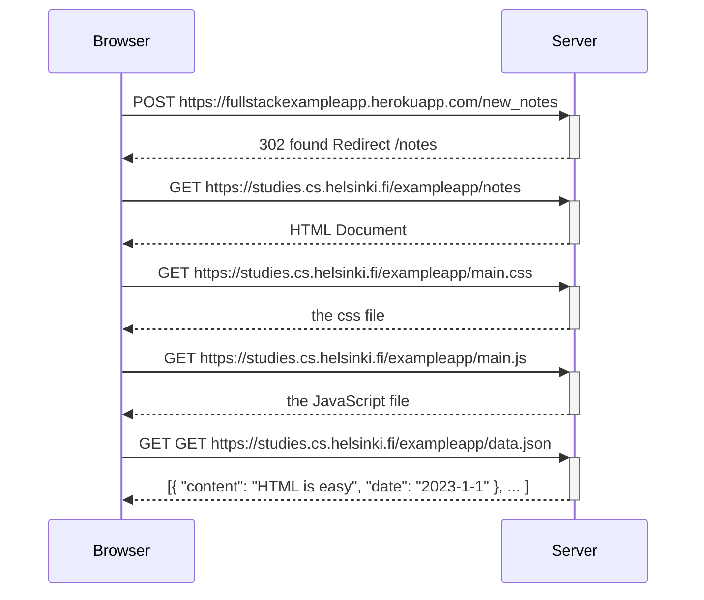

```mermaid
sequenceDiagram
    Browser->>+Server: POST https://fullstackexampleapp.herokuapp.com/new_notes
    Server-->>-Browser: 302 found Redirect /notes
    Browser->>+Server: GET https://studies.cs.helsinki.fi/exampleapp/notes
    Server-->>-Browser: HTML Document
    Browser->>+Server: GET https://studies.cs.helsinki.fi/exampleapp/main.css
    Server-->>-Browser: the css file
    Browser->>+Server : GET https://studies.cs.helsinki.fi/exampleapp/main.js
    Server-->>-Browser: the JavaScript file
    Browser->>+Server : GET GET https://studies.cs.helsinki.fi/exampleapp/data.json
    Server-->>-Browser: [{ "content": "HTML is easy", "date": "2023-1-1" }, ... ]

```
