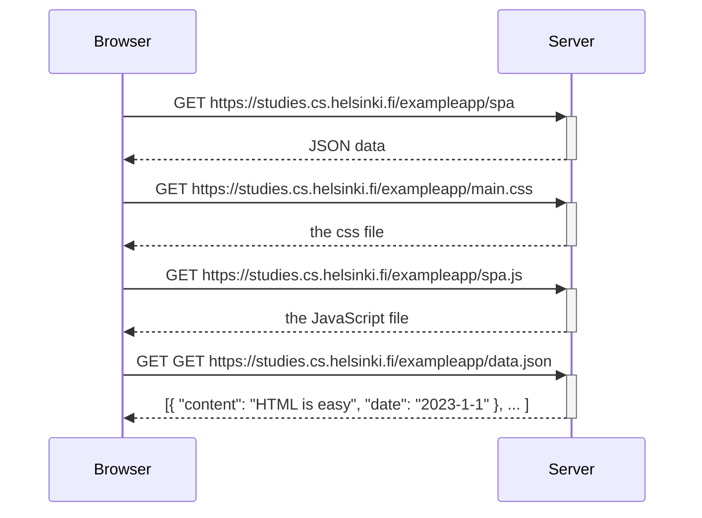

```mermaid
sequenceDiagram
    participant Browser
    participant Server
    Browser->>+Server: GET https://studies.cs.helsinki.fi/exampleapp/spa
    Server-->>-Browser: JSON data
    Browser->>+Server: GET https://studies.cs.helsinki.fi/exampleapp/main.css
    Server-->>-Browser: the css file
    Browser->>+Server : GET https://studies.cs.helsinki.fi/exampleapp/spa.js
    Server-->>-Browser: the JavaScript file
    Browser->>+Server : GET GET https://studies.cs.helsinki.fi/exampleapp/data.json
    Server-->>-Browser: [{ "content": "HTML is easy", "date": "2023-1-1" }, ... ]
```
